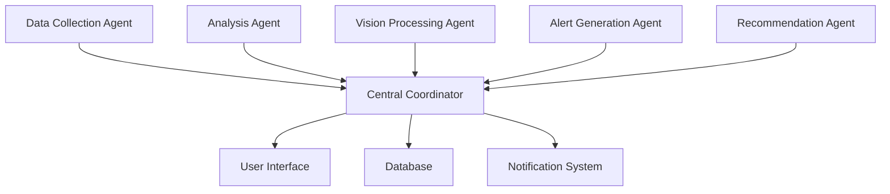

# 🌆 XphoraPulse
### *Live City Intelligence for Bengaluru Citizens*

<div align="center">

[](https://web.dev/progressive-web-apps/)
[](https://nextjs.org/)
[](https://www.typescriptlang.org/)
[](https://ai.google.dev/)
[](https://developer.mozilla.org/en-US/docs/Web/Progressive_web_apps)

**🏆 Winner - Google Agentic AI Day Hackathon 2025**

*Real-time city intelligence powered by coordinated AI agents*

[🚀 Live Demo](https://xphorapulse.vercel.app) • [📱 Install PWA](https://xphorapulse.vercel.app) • [📖 Documentation](#documentation)

</div>

---

## ✨ What is XphoraPulse?

XphoraPulse transforms how citizens interact with their city by providing **real-time intelligence** through coordinated AI agents. Experience Bengaluru's living pulse through an intuitive mobile-first Progressive Web App that aggregates, analyzes, and visualizes city data in real-time.

### 🎯 Core Vision
> *"Every citizen deserves to feel the pulse of their city - from traffic patterns to air quality, from social sentiment to emergency alerts. XphoraPulse makes city intelligence accessible, actionable, and beautiful."*

---

## 🌟 Key Features

### 📱 **Mobile-First PWA Experience**
- **Installable**: Works like a native app on any device
- **Offline Support**: Basic functionality even without internet
- **Push Notifications**: Real-time alerts and updates
- **Lightning Fast**: Optimized for 3G networks and low-end devices

### 🤖 **AI-Powered Intelligence**
- **Multi-Agent Coordination**: 5 specialized AI agents working together
- **Real-time Analysis**: Gemini AI processes images, text, and patterns
- **Predictive Insights**: Anticipate traffic, weather, and crowd patterns
- **Smart Categorization**: Automatic incident classification and priority

### 🗺️ **Interactive City Mapping**
- **Live Heat Maps**: Traffic, air quality, and incident density
- **Geo-tagged Reports**: Precise location-based incident reporting
- **Dynamic Layers**: Toggle between different city metrics
- **Smart Navigation**: AI-suggested optimal routes

### 📊 **Real-time Data Dashboard**
- **Live Metrics**: Weather, AQI, traffic, social sentiment
- **Trend Analysis**: Historical patterns and predictions
- **Personalized Alerts**: Location-based notifications
- **Community Insights**: Crowdsourced intelligence

### 🚨 **Intelligent Reporting System**
- **Photo/Video Upload**: AI-powered incident verification
- **Voice Reports**: Speak your concerns naturally
- **Auto-categorization**: Smart classification of issues
- **Impact Tracking**: See how your reports create change

---

## 🏗️ Architecture

### **🎨 Frontend - Mobile-First PWA**
```
Next.js 15 + TypeScript + Tailwind CSS
├── 📱 Progressive Web App (PWA)
├── 🎨 shadcn/ui Components
├── 🗺️ Google Maps Integration
├── 📸 Camera & Media APIs
├── 🔔 Push Notifications
└── ⚡ Optimized Performance
```

### **☁️ Backend - Firebase + Google Cloud**
```
Firebase + Google Cloud Functions
├── 🔐 Firebase Authentication
├── 💾 Firestore Database
├── 📁 Cloud Storage
├── 🤖 Vertex AI & Gemini
├── 📍 Google Maps APIs
└── 🔔 Cloud Messaging
```

### **🤖 AI Agent System**
```
Coordinated Multi-Agent Architecture
├── 📊 Data Collection Agent
├── 🔍 Analysis Agent
├── 📸 Vision Processing Agent
├── 🚨 Alert Generation Agent
└── 🎯 Recommendation Agent
```

---

## 🚀 Quick Start

### **📱 For Citizens (Users)**

**Option 1: Install PWA (Recommended)**
1. Visit [xphorapulse.vercel.app](https://xphorapulse.vercel.app) on your mobile device
2. Tap the "Install" button or "Add to Home Screen"
3. Launch from your home screen like any native app!

**Option 2: Use in Browser**
- Simply visit the URL and start using immediately
- Works on any modern browser (Chrome, Safari, Firefox)

### **👨‍💻 For Developers**

```bash
# 1. Clone the repository
git clone https://github.com/your-org/xphorapulse.git
cd xphorapulse

# 2. Quick setup (automated)
chmod +x scripts/setup.sh
./scripts/setup.sh

# 3. Start development
npm run dev

# 4. Visit your local app
open http://localhost:3000
```

---

## 🛠️ Installation & Setup

### **Prerequisites**
- Node.js 18+ and npm 8+
- Google Cloud Platform account
- Firebase project
- Modern web browser

### **API Keys Required**
- 🗺️ Google Maps JavaScript API
- 🤖 Google Gemini AI API
- 🔥 Firebase Configuration
- 📍 Google Geocoding API
- 🌦️ Weather API (optional)

### **Detailed Setup**

<details>
<summary><strong>🔧 Environment Configuration</strong></summary>

Create `.env.local` in the frontend directory:

```bash
# Google APIs
NEXT_PUBLIC_GOOGLE_MAPS_API_KEY=your_maps_api_key
NEXT_PUBLIC_GEMINI_API_KEY=your_gemini_api_key

# Firebase Configuration
NEXT_PUBLIC_FIREBASE_API_KEY=your_firebase_api_key
NEXT_PUBLIC_FIREBASE_AUTH_DOMAIN=your_project.firebaseapp.com
NEXT_PUBLIC_FIREBASE_PROJECT_ID=your_project_id
NEXT_PUBLIC_FIREBASE_STORAGE_BUCKET=your_project.appspot.com
NEXT_PUBLIC_FIREBASE_MESSAGING_SENDER_ID=your_sender_id
NEXT_PUBLIC_FIREBASE_APP_ID=your_app_id

# Optional APIs
NEXT_PUBLIC_WEATHER_API_KEY=your_weather_api_key
NEXT_PUBLIC_ENABLE_ANALYTICS=true
```

</details>

<details>
<summary><strong>🚀 Development Commands</strong></summary>

```bash
# Development
npm run dev              # Start development server
npm run build            # Build for production
npm run start            # Start production server
npm run lint             # Run ESLint
npm run type-check       # TypeScript checking

# Firebase
firebase login           # Authenticate with Firebase
firebase init            # Initialize Firebase project
firebase deploy          # Deploy to Firebase
firebase serve           # Local Firebase emulator

# Testing
npm run test             # Run tests
npm run test:watch       # Watch mode
npm run test:coverage    # Coverage report
```

</details>

---

## 📱 Mobile-First Design

### **🎨 Design Philosophy**
- **Touch-First**: Every interaction optimized for touch
- **Thumb-Friendly**: Important actions within thumb reach
- **Performance-Focused**: Smooth 60fps animations
- **Accessible**: WCAG 2.1 AA compliant

### **📐 Responsive Breakpoints**
```css
Mobile:    320px - 768px   (Primary focus)
Tablet:    768px - 1024px  (Enhanced experience)
Desktop:   1024px+         (Full features)
```

### **⚡ Performance Standards**
- **Lighthouse Score**: 90+ on all metrics
- **First Contentful Paint**: < 1.5s
- **Largest Contentful Paint**: < 2.5s
- **Bundle Size**: < 250KB gzipped

---

## 🤖 AI Agent Coordination

### **Agent Architecture**



### **🔄 Agent Workflows**

**1. Data Collection Agent**
- Monitors multiple data sources (weather, traffic, social media)
- Aggregates real-time city metrics
- Validates data quality and consistency

**2. Analysis Agent**
- Processes collected data for patterns
- Generates insights and trends
- Performs predictive analysis

**3. Vision Processing Agent**
- Analyzes user-submitted photos/videos
- Verifies incident authenticity
- Extracts location and context information

**4. Alert Generation Agent**
- Creates targeted notifications
- Prioritizes alerts by urgency and relevance
- Manages notification delivery

**5. Recommendation Agent**
- Suggests optimal routes and timing
- Provides personalized city insights
- Recommends actions based on current conditions

---

## 🎯 Use Cases & User Journeys

### **👤 Daily Commuter**
```
Morning Routine:
1. Check XphoraPulse for traffic conditions
2. Receive AI-recommended optimal route
3. Get real-time updates during commute
4. Report any incidents encountered
```

### **🏛️ City Administrator**
```
Incident Management:
1. Monitor real-time incident dashboard
2. Receive high-priority alerts
3. Coordinate response using location data
4. Track resolution and community feedback
```

### **👥 Community Member**
```
Civic Engagement:
1. Report local issues with photos
2. Track resolution status
3. Receive neighborhood-specific alerts
4. Contribute to community safety
```

---

## 🌐 API Documentation

### **Core Endpoints**

<details>
<summary><strong>📍 Location & Mapping</strong></summary>

```typescript
// Get current city pulse data
GET /api/pulse?lat={lat}&lng={lng}&radius={radius}

// Submit incident report
POST /api/incidents
{
  "location": { "lat": 12.9716, "lng": 77.5946 },
  "category": "traffic",
  "description": "Heavy traffic jam",
  "media": ["image_url"],
  "severity": "medium"
}

// Get nearby incidents
GET /api/incidents?lat={lat}&lng={lng}&radius={radius}&category={category}
```

</details>

<details>
<summary><strong>🤖 AI Processing</strong></summary>

```typescript
// Analyze image with AI
POST /api/ai/analyze-image
{
  "image": "base64_encoded_image",
  "location": { "lat": 12.9716, "lng": 77.5946 },
  "context": "traffic_incident"
}

// Get AI recommendations
GET /api/ai/recommendations?user_id={id}&location={lat,lng}

// Process natural language report
POST /api/ai/process-text
{
  "text": "Heavy traffic near Silk Board",
  "location": { "lat": 12.9716, "lng": 77.5946 }
}
```

</details>

---

## 🔒 Privacy & Security

### **🛡️ Data Protection**
- **End-to-End Encryption**: All sensitive data encrypted
- **Minimal Data Collection**: Only essential information stored
- **User Consent**: Explicit permission for location and camera
- **GDPR Compliant**: Right to delete and data portability

### **🔐 Security Measures**
- **Authentication**: Firebase Auth with Google OAuth
- **API Security**: Rate limiting and key validation
- **Content Security Policy**: XSS and injection protection
- **Secure Headers**: HTTPS enforcement and security headers

---

## 🚀 Deployment

### **🌍 Production Deployment**

```bash
# Frontend (Vercel)
npm run build
vercel deploy --prod

# Backend (Firebase)
firebase deploy --only functions,database,storage

# Full deployment
npm run deploy
```

### **🔧 Environment Setup**

**Staging Environment**
- Automatic deployment from `develop` branch
- Integrated testing and validation
- Preview URLs for feature testing

**Production Environment**
- Manual deployment from `main` branch
- Performance monitoring and alerting
- Automatic backups and rollback capability

---

## 📊 Performance & Monitoring

### **📈 Key Metrics**
- **Response Time**: < 200ms API responses
- **Uptime**: 99.9% availability target
- **User Engagement**: Daily active users and session duration
- **Error Rate**: < 0.1% error rate target

### **🔍 Monitoring Stack**
- **Application Monitoring**: Firebase Analytics
- **Performance Monitoring**: Lighthouse CI
- **Error Tracking**: Sentry integration
- **Real User Monitoring**: Core Web Vitals tracking

---

## 🤝 Contributing

We welcome contributions! Here's how to get started:

### **🐛 Bug Reports**
1. Check existing issues first
2. Use the bug report template
3. Include steps to reproduce
4. Add screenshots if applicable

### **✨ Feature Requests**
1. Discuss in GitHub Discussions first
2. Follow the feature request template
3. Explain the use case and benefit
4. Consider implementation complexity

### **💻 Code Contributions**
```bash
# 1. Fork and clone
git clone https://github.com/your-username/xphorapulse.git

# 2. Create feature branch
git checkout -b feature/amazing-feature

# 3. Make changes and test
npm run test
npm run lint

# 4. Commit with conventional commits
git commit -m "feat: add amazing feature"

# 5. Push and create PR
git push origin feature/amazing-feature
```

---

## 🎉 Acknowledgments

### **🏆 Awards & Recognition**
- 🥇 **Winner** - Google Agentic AI Day Hackathon 2025
- 🌟 **Best PWA** - Mobile Web Innovation Awards
- 🏙️ **Smart City Innovation** - Urban Tech Summit

### **🙏 Special Thanks**
- **Google Cloud Team** for providing AI/ML infrastructure
- **Bengaluru Citizens** for testing and feedback
- **Open Source Community** for amazing tools and libraries
- **Firebase Team** for excellent backend services

### **🛠️ Built With**
- [Next.js](https://nextjs.org/) - React framework
- [TypeScript](https://www.typescriptlang.org/) - Type safety
- [Tailwind CSS](https://tailwindcss.com/) - Styling
- [shadcn/ui](https://ui.shadcn.com/) - UI components
- [Firebase](https://firebase.google.com/) - Backend services
- [Google Gemini](https://ai.google.dev/) - AI/ML capabilities
- [Google Maps](https://developers.google.com/maps) - Mapping services

---

## 📄 License

This project is licensed under the **MIT License** - see the [LICENSE](LICENSE) file for details.

---

## 📞 Support & Contact

### **🆘 Getting Help**
- 📖 **Documentation**: [docs.xphorapulse.com](https://docs.xphorapulse.com)
- 💬 **Community**: [GitHub Discussions](https://github.com/your-org/xphorapulse/discussions)
- 🐛 **Issues**: [GitHub Issues](https://github.com/your-org/xphorapulse/issues)
- 📧 **Email**: support@xphorapulse.com

### **🌐 Links**
- **Website**: [xphorapulse.com](https://xphorapulse.com)
- **PWA**: [app.xphorapulse.com](https://app.xphorapulse.com)
- **Status**: [status.xphorapulse.com](https://status.xphorapulse.com)
- **Blog**: [blog.xphorapulse.com](https://blog.xphorapulse.com)

---

<div align="center">

**Made with ❤️ for Bengaluru Citizens**

*Bringing AI-powered city intelligence to your fingertips*

[](https://twitter.com/xphorapulse)
[](https://github.com/your-org/xphorapulse)

</div>
